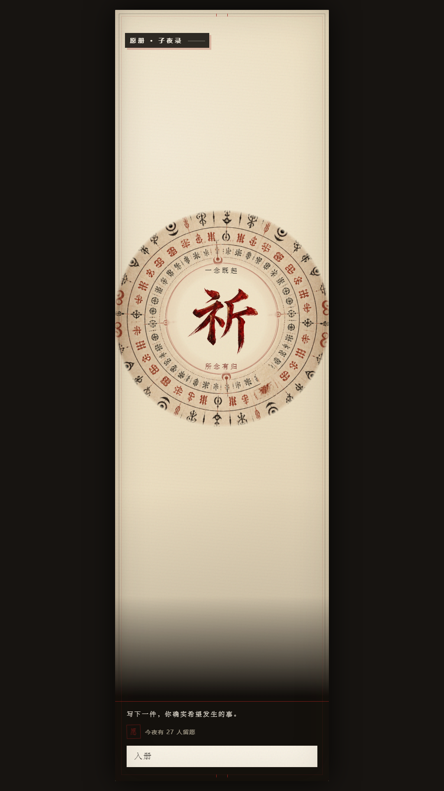
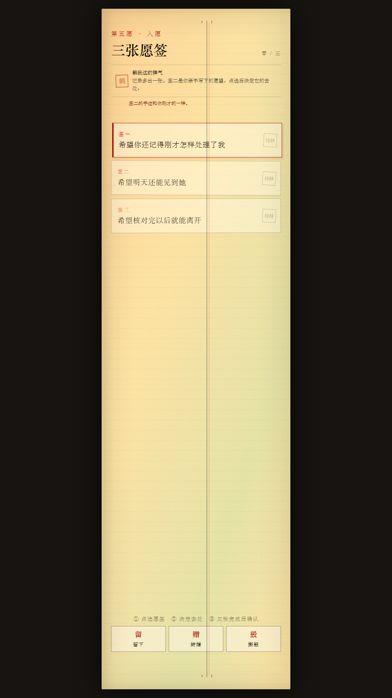

# 祈

**愿望成真以前，先替它决定代价。**


《祈》是一款为手机竖屏设计的互动叙事微恐网页游戏，由 **HBaopiqi－鹤我这豹脾气** 制作。你将写下一个名字和一个愿望，替陌生人的愿签决定去处，再等待自己的愿望入册。

愿册承诺：先助人愿，后成己愿。可当编号开始重复、来信变得熟悉、选项在你触碰之前自行落定，你还能守住最初写下的那句话吗？

[在线游玩《祈》](https://qi-wish-ledger.hbaopiqi.chatgpt.site)

## 如何游玩

建议使用手机竖屏并戴上耳机。首次进入时，点击进入以启用声音；随后阅读入册规矩、填写称呼与愿望，跟随祝文完成落印。

在助愿过程中，先点选愿签，再为它选择留下、转赠或撕毁。留意来信、愿签背面与操作记录的变化。游戏后段包含叙事性的界面异常和强制选择。

内容包含惊吓、闪烁、压迫音效及支持设备上的振动反馈。网页振动由设备和浏览器决定，部分 iPhone 浏览器不支持 Web Vibration API。

## 游戏特色

- 留名、许愿、念祝与按住落印组成的仪式流程。
- 愿签处置、来信对话与记录核验交织推进的故事。
- 累积显现的祝文、变化的选项与逐步失控的界面。
- 多阶段背景音乐、独立音效与触感反馈。
- 融入玩家称呼和愿望的结尾叙事。

## 画面

| 愿册入口 | 愿签抉择 |
| --- | --- |
|  |  |

## 本地运行

项目使用原生 HTML、CSS 与 JavaScript，不需要构建或安装前端依赖。请通过静态服务器运行，以正常加载音频配置和资源。

安装 Python 后，在仓库目录执行：

```sh
python -m http.server 8080
```

然后打开 `http://localhost:8080/`。也可使用编辑器的静态预览服务。

## 部署

将 `index.html`、`styles.css`、`game.js` 和整个 `assets/` 目录上传至静态网站服务。资源使用相对路径，支持网站根目录和子目录部署。推荐 HTTPS。

详细方法见 [部署说明](docs/DEPLOYMENT.md)。游戏内容与音视频都在本仓库内，无需数据库或服务端程序。

## 目录

```text
.
├── index.html          # 场景与界面结构
├── styles.css          # 布局、响应式样式和视觉效果
├── game.js             # 剧情、交互、音频与触感逻辑
├── assets/
│   ├── audio/          # 背景音乐、音效和配置
│   └── images/         # 字标与仪式纹样
└── docs/               # 部署、隐私和素材说明
```

## 隐私

游戏没有账号注册、数据库或分析统计。玩家填写的称呼与愿望保存在当前标签页的 `sessionStorage` 中，用于本次叙事；游戏代码不会将这些输入发送到服务器。完整流程结束时清除相关数据，关闭标签页后会话数据通常也会释放。

网站托管服务可能记录正常访问日志。详见 [隐私说明](docs/PRIVACY.md)。

